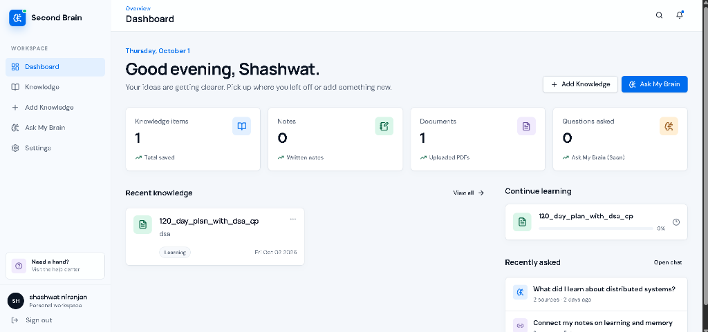

# 🧠 Smart Second Brain

A full-stack web application designed to act as your digital second brain. Store, organize, and retrieve your knowledge items—including rich-text notes, web links, and PDF documents—all in one secure place.



## 🚀 Features

- **Dashboard Analytics**: Real-time statistics on your stored knowledge, notes, documents, and recent activity.
- **Secure Authentication**: Full user signup and login flow secured by JWT and bcrypt password hashing.
- **Rich Knowledge Library**: Save multiple types of content:
  - 📝 **Notes**: Rich-text personal notes.
  - 📄 **Documents**: Upload PDFs directly to the cloud.
  - 🔗 **Links**: Save URLs for later reading.
- **Cloud Object Storage (Cloudflare R2)**: PDF uploads are securely streamed to Cloudflare R2 edge storage. Files are completely private and only accessible to authenticated users via short-lived signed URLs.
- **Modern Tech Stack**: Fast, responsive, and beautiful UI.

## 🛠️ Tech Stack

**Frontend:**
- React 19
- Vite
- TanStack Router & TanStack Query
- Tailwind CSS & shadcn/ui components

**Backend:**
- Node.js & Express
- MongoDB & Mongoose
- AWS SDK (for Cloudflare R2 S3 API)
- Multer (in-memory parsing)
- JSON Web Tokens (JWT)

## 📦 Getting Started

### Prerequisites
- Node.js (v18+)
- MongoDB connection string
- Cloudflare R2 (or AWS S3) Bucket credentials

### 1. Clone & Install
```bash
git clone https://github.com/shashwatniranjan-max/SecondBrainApp.git
cd SecondBrainApp

# Install backend dependencies
cd Backend
npm install

# Install frontend dependencies
cd ../frontend
npm install
```

### 2. Environment Setup

Create a `.env` file in the `Backend` directory:
```env
PORT=5000
MONGODB_URI=your_mongodb_connection_string
JWT_SECRET=your_jwt_secret
CLIENT_URL=http://localhost:8080

# Cloudflare R2 Storage (S3 API)
R2_ACCOUNT_ID=your_account_id
R2_ACCESS_KEY_ID=your_access_key
R2_SECRET_ACCESS_KEY=your_secret_key
R2_BUCKET_NAME=your_bucket_name
```

### 3. Running the App

Start the backend server:
```bash
cd Backend
npm run build
npm start
```

Start the frontend development server:
```bash
cd frontend
npm run dev
```

The frontend will be available at `http://localhost:8080` (or the port specified by Vite).

## 🔒 Security Highlights
- **No Path Traversal**: Filenames are sanitized and appended with unique UUIDs before uploading to R2.
- **Presigned URLs**: Users never interact with the R2 bucket directly. The backend signs short-lived (1-hour) tokens so PDFs can be securely streamed to the browser natively.
- **Strict File Limits**: Multer is restricted to `application/pdf` in-memory with a hard 20MB limit.
- **Atomic Operations**: Database records and cloud objects are strictly synchronized. If a cloud deletion fails, the database safely aborts to prevent orphaned records.

## 📄 License
This project is licensed under the MIT License.
